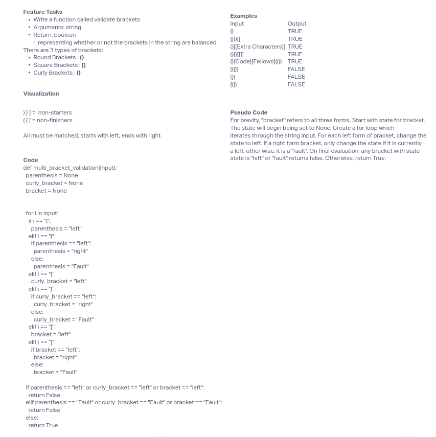

# Class 13 - Code Challenge - Multi-bracket Validation

In this challenge, the goal is to carry out bracket notation validation. All brackets must be matched up and no premature right brackets, nor unclosed left brackets can be accepted.

## Whiteboard Process

## Approach & Efficiency

My first inclination was to use regex. But then I thought that woul actually be too difficult to implement. Maybe I was wrong. But I got the chance to solve it using a new way for me. I tried at first using the eval() method. That worked, but not for the last few. My next thought was to use state. After working out some wrinkles, it worked, very well. Some final fixes to formatting and all worked.

## Solution

Run `pytest` to confirm functionality.

1. Creat virtual environment:  `python3 -m venv .venv`
2. Activate virtual environment: `source .venv/bin/activate`
3. Freeze requirements: `pip freeze > requirements.txt`
4. Install test: `pip install pytest`

Note, sometimes pytest needs to be uninstalled and reinstalled if it was previous installed under another directory.
