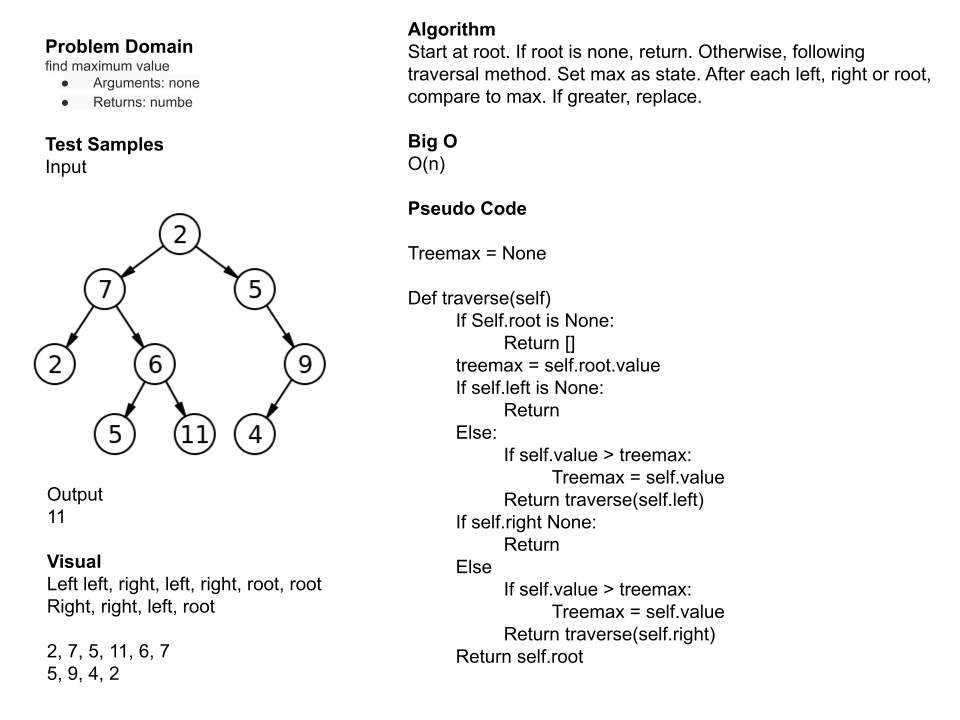

# Class 16 - Code Challenge - Maximum Value in a Binary Tree

In this challenge, the goal is to find the max value within a binary tree. To make this possible, the the find_maximum_value function utilizes two key pieces. One, if the node is none, it is set to negative infinity. Two, the funciton returns the max among the nodes traversals, left, right, and base.

## White Board

## Approach & Efficiency

My approach was of course to traverse the nodes. However, I had a bit of difficulty coming up with a method to return the max. My whiteboard pseudo code was very lacking in proper code. However, the ideas were there. I then suddenly thought to use the max python method. The final key that I needed to solve was resolving the nodes with a value of None. To resolve this, I set them to negative infinity per chatgpt advice. I thought maybe this was the way, but I didn't know how to write negative infinity in python.

## Solution

Run `pytest` to confirm functionality.

1. Creat virtual environment:  `python3 -m venv .venv`
2. Activate virtual environment: `source .venv/bin/activate`
3. Freeze requirements: `pip freeze > requirements.txt`
4. Install test: `pip install pytest`

Note, sometimes pytest needs to be uninstalled and reinstalled if it was previous installed under another directory.
