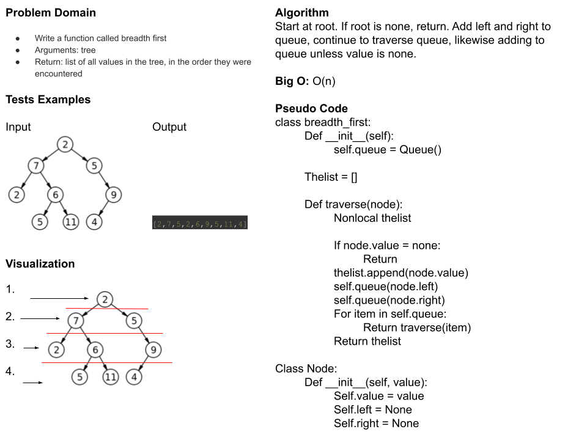

# Class 17 - Code Challenge - Breadth-first Traversal

Utilizing a breadth-first traversal, creates output of node values from a binary tree.

## White Board

## Approach & Efficiency

I didn't really know what I was doing. I thought this needed dequeue and enqueue methods but it appears that might not be the case. I don't know how to implement it otherwise, as the results online only supported a list. Trying the enqueue and dequeue methods from queue resulted in a value error issue.

## Solution

See linked_list_pack.

Run `pytest` to confirm functionality.

1. Creat virtual environment:  `python3 -m venv .venv`
2. Activate virtual environment: `source .venv/bin/activate`
3. Freeze requirements: `pip freeze > requirements.txt`
4. Install test: `pip install pytest`

Note, sometimes pytest needs to be uninstalled and reinstalled if it was previous installed under another directory.
